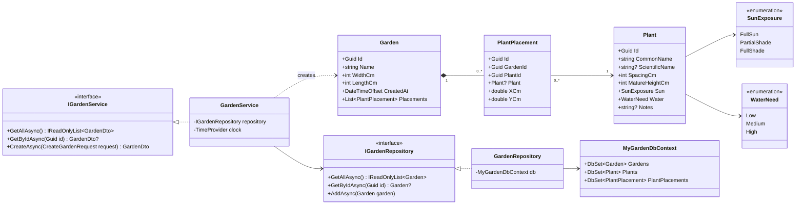
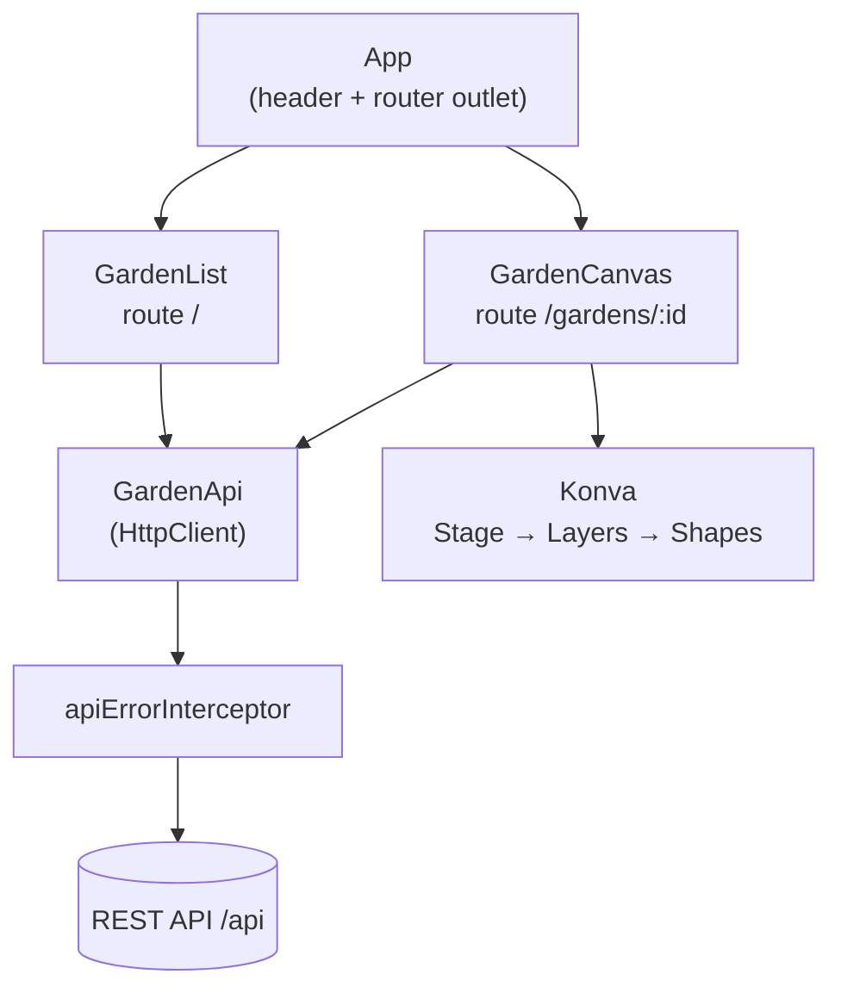
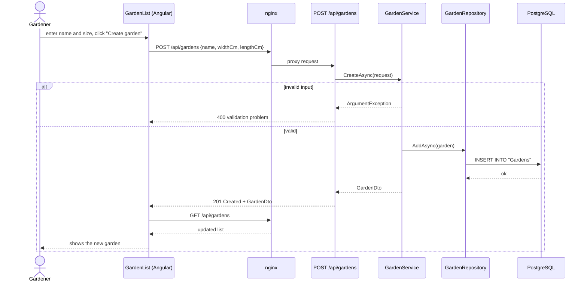
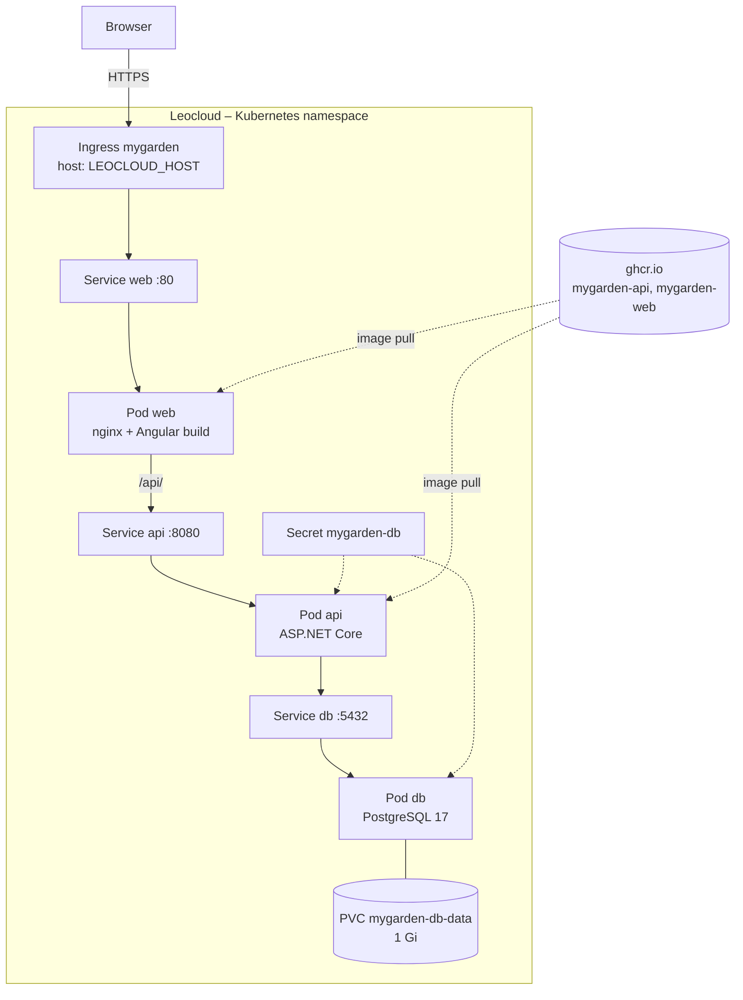

# UML Diagrams

## Class diagram – backend

```mermaid
classDiagram
    direction LR

    class Garden {
        +Guid Id
        +string Name
        +int WidthCm
        +int LengthCm
        +DateTimeOffset CreatedAt
        +List~PlantPlacement~ Placements
    }
    class Plant {
        +Guid Id
        +string CommonName
        +string? ScientificName
        +int SpacingCm
        +int MatureHeightCm
        +SunExposure Sun
        +WaterNeed Water
        +string? Notes
    }
    class PlantPlacement {
        +Guid Id
        +Guid GardenId
        +Guid PlantId
        +Plant? Plant
        +double XCm
        +double YCm
    }
    class SunExposure {
        <<enumeration>>
        FullSun
        PartialShade
        FullShade
    }
    class WaterNeed {
        <<enumeration>>
        Low
        Medium
        High
    }

    class IGardenService {
        <<interface>>
        +GetAllAsync() IReadOnlyList~GardenDto~
        +GetByIdAsync(Guid id) GardenDto?
        +CreateAsync(CreateGardenRequest request) GardenDto
    }
    class GardenService {
        -IGardenRepository repository
        -TimeProvider clock
    }
    class IGardenRepository {
        <<interface>>
        +GetAllAsync() IReadOnlyList~Garden~
        +GetByIdAsync(Guid id) Garden?
        +AddAsync(Garden garden)
    }
    class GardenRepository {
        -MyGardenDbContext db
    }
    class MyGardenDbContext {
        +DbSet~Garden~ Gardens
        +DbSet~Plant~ Plants
        +DbSet~PlantPlacement~ PlantPlacements
    }

    Garden "1" *-- "0..*" PlantPlacement
    PlantPlacement "0..*" --> "1" Plant
    Plant --> SunExposure
    Plant --> WaterNeed

    IGardenService <|.. GardenService
    GardenService --> IGardenRepository
    IGardenRepository <|.. GardenRepository
    GardenRepository --> MyGardenDbContext
    GardenService ..> Garden : creates
```

## Component diagram – frontend

```mermaid
flowchart TB
    App["App<br/>(header + router outlet)"]
    App --> GardenList["GardenList<br/>route /"]
    App --> GardenCanvas["GardenCanvas<br/>route /gardens/:id"]
    GardenList --> GardenApi
    GardenCanvas --> GardenApi
    GardenCanvas --> Konva["Konva<br/>Stage → Layers → Shapes"]
    GardenApi["GardenApi<br/>(HttpClient)"] --> Interceptor["apiErrorInterceptor"]
    Interceptor --> Backend[("REST API /api")]
```

## Sequence diagram – create a garden

```mermaid
sequenceDiagram
    actor G as Gardener
    participant L as GardenList (Angular)
    participant N as nginx
    participant E as POST /api/gardens
    participant S as GardenService
    participant R as GardenRepository
    participant D as PostgreSQL

    G->>L: enter name and size, click "Create garden"
    L->>N: POST /api/gardens {name, widthCm, lengthCm}
    N->>E: proxy request
    E->>S: CreateAsync(request)
    alt invalid input
        S-->>E: ArgumentException
        E-->>L: 400 validation problem
    else valid
        S->>R: AddAsync(garden)
        R->>D: INSERT INTO "Gardens"
        D-->>R: ok
        S-->>E: GardenDto
        E-->>L: 201 Created + GardenDto
        L->>N: GET /api/gardens
        N-->>L: updated list
        L-->>G: shows the new garden
    end
```

## Deployment diagram – Leocloud

```mermaid
flowchart TB
    user["Browser"] -- "HTTPS" --> ingress

    subgraph leocloud["Leocloud – Kubernetes namespace"]
        ingress["Ingress mygarden<br/>host: LEOCLOUD_HOST"]
        ingress --> websvc["Service web :80"]
        websvc --> webpod["Pod web<br/>nginx + Angular build"]
        webpod -- "/api/" --> apisvc["Service api :8080"]
        apisvc --> apipod["Pod api<br/>ASP.NET Core"]
        apipod --> dbsvc["Service db :5432"]
        dbsvc --> dbpod["Pod db<br/>PostgreSQL 17"]
        dbpod --- pvc[("PVC mygarden-db-data<br/>1 Gi")]
        secret["Secret mygarden-db"] -.-> apipod
        secret -.-> dbpod
    end

    ghcr[("ghcr.io<br/>mygarden-api, mygarden-web")] -. "image pull" .-> webpod
    ghcr -. "image pull" .-> apipod
```
